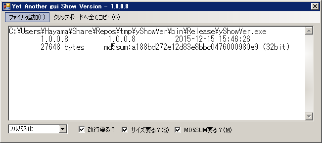

yShowVer - Yet another Show Windows-executable's Version
=========================================================

[ReleaseNote](./release_note.md)



```
yShowVer {options} FILENAME(s)
```

options
-------

- `/rawpath` - Print path as given
- `/fullpath` - Print full-path
- `/nameonly` - Print filename but directory
- `-c` - Do not print CRLF
- `+c` - Print CRLF
- `-m` - Do not print MD5
- `+m` - Print MD5
- `-s` - Do not print SIZE
- `+s` - Print SIZE
- `-b` - Do not print Bit-Size
- `+b` - Print Bit-Size
- `-` - Read path(s) from STDIN
